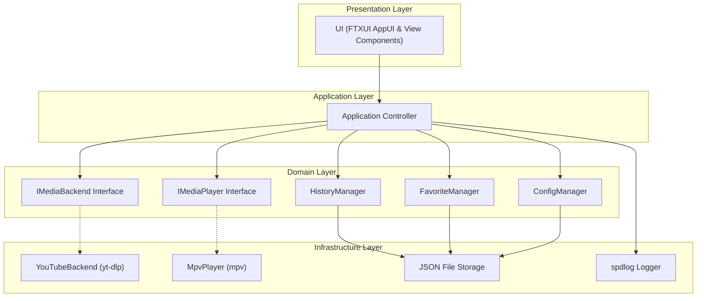

# MediaCLI

```
  __  __ _____ ____  ___    _     ____ _     ___ 
 |  \/  | ____|  _ \|_ _|  / \   / ___| |   |_ _|
 | |\/| |  _| | | | || |  / _ \ | |   | |    | | 
 | |  | | |___| |_| || | / ___ \| |___| |___ | | 
 |_|  |_|_____|____/|___/_/   \_\ \____|_____|___|
```

MediaCLI is a lightweight, modern, and modular terminal media client built in C++20 using FTXUI. It provides an intuitive terminal interface to search, stream, download, and manage media using a modular backend architecture.

---

## Features

- **Modular Backend System (`IMediaBackend`)**: The core application logic is completely decoupled from media providers. The YouTube backend operates using `yt-dlp`. Additional backends (Spotify, SoundCloud, Podcasts, Local Files) can be implemented without changing the core application or user interface.
- **Decoupled Player System (`IMediaPlayer`)**: Media playback is handled via an abstract player interface. Built-in support for `mpv` handles video playback or audio-only streaming.
- **Asynchronous Execution**: Expensive operations such as media searching and stream URL resolution run on background worker threads accompanied by real-time TUI braille spinner animations (`⠋ ⠙ ⠹ ⠸ ⠼ ⠴ ⠦ ⠧ ⠇ ⠏`), preventing screen freezing.
- **Watch History & Favorites**: Automatically saves playback history and allows bookmarking favorite media items locally in JSON format (`~/.config/mediacli/`).
- **Browser Cookie Import**: Supports importing cookies from Firefox, Chrome, Chromium, Brave, and Edge with automatic fallback if cookies fail.
- **Clean Fullscreen Rendering**: Runs in terminal Alternate Screen Buffer (`ScreenInteractive::Fullscreen()`). Logging output is saved to `logs/error.log` to prevent terminal scrollback buffer corruption.

---

## Software Architecture

MediaCLI is structured into four distinct layers:



### Core Architecture Components

1. **Presentation Layer (`src/ui/`)**: Built with FTXUI. Manages the terminal screens (Main Menu, Search Input, Search Results, Video Action Menu, Watch History, Favorite Media, Settings, and About).
2. **Application Layer (`src/core/Application.hpp`)**: Central controller that coordinates search queries, stream playback, file downloading, and persistence.
3. **Domain & Infrastructure Layer (`src/backend/`, `src/player/`)**:
   - `IMediaBackend`: Pure virtual interface for media providers (`search`, `getStreamUrl`, `download`).
   - `YouTubeBackend`: Implements `IMediaBackend` via non-blocking `yt-dlp` subprocess calls using flat playlist JSON extraction.
   - `IMediaPlayer`: Pure virtual interface for media playback (`play`, `stop`, `isPlaying`).
   - `MpvPlayer`: Implements `IMediaPlayer` by launching `mpv` interactively.
4. **Data Persistence (`src/history/`, `src/favorite/`, `src/config/`)**: Manages JSON data stored in `~/.config/mediacli/`.

---

## Directory Structure

```
media-cli/
├── CMakeLists.txt                  # Build configuration with FetchContent dependencies
├── README.md                       # Documentation
├── LICENSE                         # MIT License
├── .gitignore                      # Git exclusion rules
├── src/
│   ├── main.cpp                    # Entry point
│   ├── core/
│   │   ├── Application.hpp / .cpp  # Central Application controller
│   │   ├── MediaInfo.hpp           # Media metadata model
│   │   └── Types.hpp               # Common enums (VideoQuality, ViewState)
│   ├── backend/
│   │   ├── IMediaBackend.hpp       # Backend interface
│   │   ├── BackendFactory.hpp/.cpp # Factory for creating backends
│   │   └── youtube/
│   │       ├── YouTubeBackend.hpp  # YouTube backend header
│   │       └── YouTubeBackend.cpp  # yt-dlp process runner
│   ├── player/
│   │   ├── IMediaPlayer.hpp        # Player interface
│   │   ├── PlayerFactory.hpp/.cpp  # Factory for creating players
│   │   └── mpv/
│   │       ├── MpvPlayer.hpp       # mpv player header
│   │       └── MpvPlayer.cpp       # mpv runner
│   ├── ui/
│   │   ├── App.hpp / .cpp          # Main FTXUI screen coordinator & async threads
│   │   ├── Theme.hpp               # Colors and header styling
│   │   ├── MainMenu.hpp / .cpp     # Centered Main Menu
│   │   ├── SearchView.hpp / .cpp   # Search input and spinner
│   │   ├── ResultsView.hpp / .cpp  # Media search results table
│   │   ├── VideoMenu.hpp / .cpp    # Context action menu
│   │   ├── HistoryView.hpp / .cpp  # Watch history screen
│   │   ├── FavoritesView.hpp / .cpp# Favorite media screen
│   │   ├── SettingsView.hpp / .cpp # Settings form
│   │   └── AboutView.hpp / .cpp    # About screen and GitHub link
│   ├── history/
│   │   └── HistoryManager.hpp/.cpp # Watch history storage
│   ├── favorite/
│   │   └── FavoriteManager.hpp/.cpp# Favorites storage
│   ├── config/
│   │   └── ConfigManager.hpp / .cpp# Configuration storage
│   └── utils/
│       ├── Logger.hpp / .cpp       # Logging utility (logs/error.log)
│       ├── Process.hpp / .cpp      # Subprocess runner & escaping
│       └── FileUtils.hpp / .cpp    # Path and JSON helpers
```

---

## Tech Stack & Dependencies

### C++ Libraries (Fetched via CMake `FetchContent`)

- **FTXUI** (v5.0.0) — Functional Terminal User Interface framework
- **nlohmann/json** (v3.11.3) — JSON serialization
- **fmt** (v10.2.1) — Fast formatting library
- **spdlog** (v1.13.0) — Logging library

### System Prerequisites

- C++20 compatible compiler (GCC 10+ or Clang 11+)
- CMake (v3.16+)
- `yt-dlp`
- `mpv`

---

## Building and Installation

### Install System Dependencies

```bash
# Ubuntu / Debian
sudo apt update
sudo apt install build-essential cmake yt-dlp mpv

# Arch Linux
sudo pacman -S gcc cmake yt-dlp mpv

# Fedora
sudo dnf install gcc-c++ cmake yt-dlp mpv
```

### Build Instructions

```bash
git clone https://github.com/izzulgod/media-cli.git
cd media-cli

cmake -B build -S .
cmake --build build -j$(nproc)
```

### Running MediaCLI

```bash
./build/mediacli
```

---

## Navigation & Controls

| Screen | Action | Key / Control |
|---|---|---|
| **Global** | Return to Main Menu | `ESC` |
| **Main Menu** | Navigate Options | `Up` / `Down` |
| **Main Menu** | Select Option | `Enter` |
| **Main Menu** | Exit App | `q` / `ESC` |
| **Search Results** | Select Item | `Up` / `Down` |
| **Search Results** | Open Video Actions | `Enter` |
| **Settings** | Switch Form Fields | `Tab` / `Shift+Tab` |
| **mpv Player** | Pause / Play | `Space` |
| **mpv Player** | Seek | `Left` / `Right` |
| **mpv Player** | Quit Playback | `q` |

---

## Configuration

Settings are saved in `~/.config/mediacli/config.json`:

```json
{
    "backend": "youtube",
    "cookie_browser": "",
    "download_path": "~/Downloads/MediaCLI",
    "player": "mpv",
    "theme": "dark",
    "video_quality": "best"
}
```

---

## Extending MediaCLI (Adding New Backends)

To implement a new provider (e.g., Spotify, SoundCloud):

1. Create a new backend class deriving from `IMediaBackend`:
   ```cpp
   #include "backend/IMediaBackend.hpp"

   namespace mediacli {

   class SpotifyBackend : public IMediaBackend {
   public:
       std::string name() const override { return "spotify"; }
       std::vector<MediaInfo> search(const std::string& query, int limit = 20) override;
       std::string getStreamUrl(const MediaInfo& media, VideoQuality quality) override;
       bool download(const MediaInfo& media, const std::string& downloadPath, VideoQuality quality) override;
       void setCookieBrowser(const std::string& browserName) override;
   };

   } // namespace mediacli
   ```
2. Register the implementation in `BackendFactory::create()`:
   ```cpp
   if (name == "spotify") {
       return std::make_unique<SpotifyBackend>();
   }
   ```

---

## License

- **License**: Distributed under the [MIT License](LICENSE).
