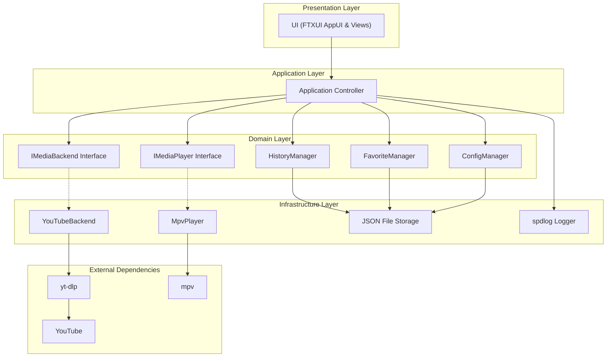
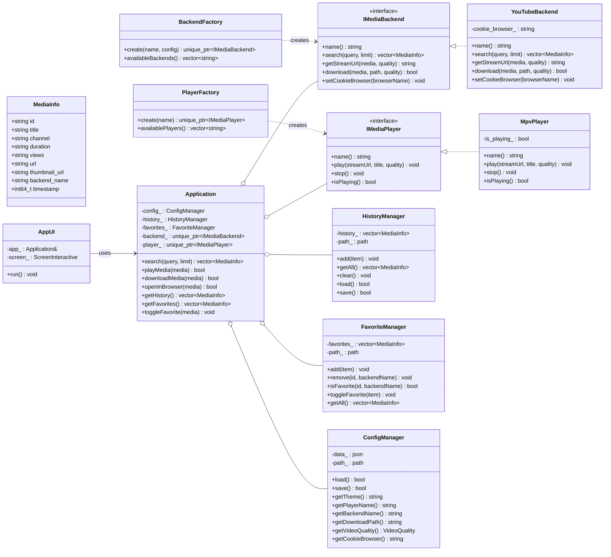
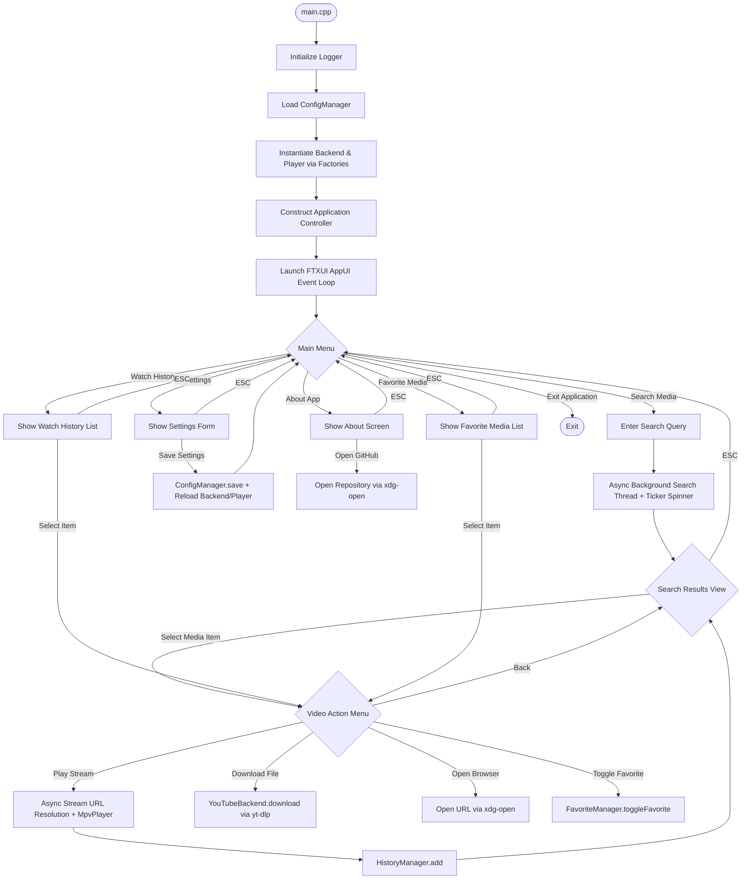

# MediaCLI

```
  __  __ _____ ____  ___    _     ____ _     ___ 
 |  \/  | ____|  _ \|_ _|  / \   / ___| |   |_ _|
 | |\/| |  _| | | | || |  / _ \ | |   | |    | | 
 | |  | | |___| |_| || | / ___ \| |___| |___ | | 
 |_|  |_|_____|____/|___/_/   \_\ \____|_____|___|
```

MediaCLI is a lightweight, modern, and modular terminal media client written in C++20 using FTXUI. It is designed around a strictly decoupled backend architecture that separates application business logic, user interface rendering, media provider backends, and playback engines.

---

## Architecture Overview

MediaCLI follows a layered domain-driven architecture with clean separation of concerns:



### Architectural Principles

- **Zero Direct Provider Coupling**: The core Application controller and FTXUI Presentation layer never interact directly with YouTube, yt-dlp, or mpv.
- **Interface Abstraction**: All media providers implement `IMediaBackend`. All media players implement `IMediaPlayer`.
- **Extensible Backend System**: Adding a new provider (e.g., Spotify, SoundCloud, Podcasts, Local Files) requires zero modifications to core Application or UI logic.
- **Asynchronous Execution**: Expensive IO operations (searching, stream URL resolution) run on background threads with real-time TUI braille spinner animations, ensuring the TUI never hangs or blocks.
- **Alternate Screen Buffer Isolation**: FTXUI renders in Fullscreen mode (`ScreenInteractive::Fullscreen()`). Logging output is written strictly to `logs/error.log` to preserve terminal screen cleanliness.

---

## Class Architecture



---

## Application Control Flow



---

## Directory Structure & Module Responsibilities

```
Media-CLI/
├── CMakeLists.txt                  # Build configuration with FetchContent dependencies
├── README.md                       # Complete technical documentation
├── LICENSE                         # MIT License
├── .gitignore                      # Git exclusion rules
├── src/
│   ├── main.cpp                    # Application entry point
│   ├── core/
│   │   ├── Application.hpp / .cpp  # Central Application controller orchestrator
│   │   ├── MediaInfo.hpp           # Data model struct with JSON serialization
│   │   └── Types.hpp               # VideoQuality, ViewState enums, and helpers
│   ├── backend/
│   │   ├── IMediaBackend.hpp       # Pure virtual interface for media providers
│   │   ├── BackendFactory.hpp/.cpp # Factory for instantiating backend implementations
│   │   └── youtube/
│   │       ├── YouTubeBackend.hpp  # YouTube provider header
│   │       └── YouTubeBackend.cpp  # yt-dlp process runner & JSON extractor
│   ├── player/
│   │   ├── IMediaPlayer.hpp        # Pure virtual interface for media players
│   │   ├── PlayerFactory.hpp/.cpp  # Factory for instantiating media players
│   │   └── mpv/
│   │       ├── MpvPlayer.hpp       # mpv player wrapper header
│   │       └── MpvPlayer.cpp       # Interactive mpv subprocess runner
│   ├── ui/
│   │   ├── App.hpp / .cpp          # FTXUI root controller, screen manager & async worker coordinator
│   │   ├── Theme.hpp               # Color palette definitions & header elements
│   │   ├── MainMenu.hpp / .cpp     # Centered Main Menu component
│   │   ├── SearchView.hpp / .cpp   # Non-blocking search query input & braille spinner
│   │   ├── ResultsView.hpp / .cpp  # Scrollable wide media result table
│   │   ├── VideoMenu.hpp / .cpp    # Context action menu for selected media items
│   │   ├── HistoryView.hpp / .cpp  # Watch history list screen
│   │   ├── FavoritesView.hpp / .cpp# Favorite media list screen
│   │   ├── SettingsView.hpp / .cpp # Interactive configuration form
│   │   └── AboutView.hpp / .cpp    # Centered About page with interactive GitHub link
│   ├── history/
│   │   ├── HistoryManager.hpp/.cpp # Local watch history JSON persistence
│   ├── favorite/
│   │   ├── FavoriteManager.hpp/.cpp# Local favorite media JSON persistence
│   ├── config/
│   │   ├── ConfigManager.hpp / .cpp# User preferences JSON manager
│   └── utils/
│       ├── Logger.hpp / .cpp       # spdlog configuration (file-only sink)
│       ├── Process.hpp / .cpp      # Subprocess execution & shell argument escaping
│       └── FileUtils.hpp / .cpp    # Path tilde expansion & directory helpers
```

---

## Tech Stack & Dependencies

### C++ Libraries (Managed via CMake `FetchContent`)

- **FTXUI** (v5.0.0) — Functional Terminal User Interface framework.
- **nlohmann/json** (v3.11.3) — JSON parser and serializer.
- **fmt** (v10.2.1) — Safe, fast string formatting library.
- **spdlog** (v1.13.0) — Fast C++ logging library.

### External System Utilities

- **yt-dlp** — Extracting metadata, stream URLs, and downloading media.
- **mpv** — Native media player for video and audio playback.

---

## Prerequisites & Installation

### System Dependencies Installation

```bash
# Ubuntu / Debian
sudo apt update
sudo apt install build-essential cmake yt-dlp mpv

# Arch Linux
sudo pacman -S gcc cmake yt-dlp mpv

# Fedora
sudo dnf install gcc-c++ cmake yt-dlp mpv
```

### Build Instructions

```bash
# Clone the repository
git clone https://github.com/izzulgod/media-cli.git
cd media-cli

# Configure and compile
cmake -B build -S .
cmake --build build -j$(nproc)
```

### Execution

```bash
./build/mediacli
```

---

## Keyboard Controls & Navigation

| Context | Action | Shortcut |
|---|---|---|
| **Global** | Return to Main Menu | `ESC` |
| **Main Menu** | Navigate Options | `Up` / `Down` |
| **Main Menu** | Select Option | `Enter` |
| **Main Menu** | Quick Exit | `q` / `ESC` |
| **Search Results** | Navigate Results List | `Up` / `Down` |
| **Search Results** | Open Media Action Menu | `Enter` |
| **Settings / Forms** | Move Between Form Input Fields | `Tab` / `Shift+Tab` |
| **Player (mpv)** | Pause / Play Media | `Space` |
| **Player (mpv)** | Seek Backward / Forward | `Left` / `Right` |
| **Player (mpv)** | Volume Control | `9` / `0` |
| **Player (mpv)** | Quit Playback | `q` |

---

## Configuration & Storage Formats

MediaCLI stores configuration and user data under `~/.config/mediacli/`:

### `config.json`
```json
{
    "backend": "youtube",
    "cookie_browser": "",
    "download_path": "~/Downloads/MediaCLI",
    "player": "mpv",
    "theme": "dark",
    "video_quality": "best"
}
```

### `history.json` & `favorites.json`
```json
[
    {
        "backend_name": "youtube",
        "channel": "Deddy Corbuzier",
        "duration": "1:20:49",
        "id": "WzW3hUqnaGI",
        "thumbnail_url": "https://i.ytimg.com/vi/WzW3hUqnaGI/hqdefault.jpg",
        "timestamp": 1784760292,
        "title": "Example Video Title",
        "url": "https://www.youtube.com/watch?v=WzW3hUqnaGI",
        "views": "3.8M"
    }
]
```

---

## Developer Guide: Adding New Backends

To add a new media backend (e.g., Spotify, SoundCloud, Podcasts):

1. Create a class implementing `IMediaBackend`:
   ```cpp
   #include "backend/IMediaBackend.hpp"

   namespace mediacli {

   class SpotifyBackend : public IMediaBackend {
   public:
       std::string name() const override { return "spotify"; }
       std::vector<MediaInfo> search(const std::string& query, int limit = 20) override;
       std::string getStreamUrl(const MediaInfo& media, VideoQuality quality) override;
       bool download(const MediaInfo& media, const std::string& downloadPath, VideoQuality quality) override;
       void setCookieBrowser(const std::string& browserName) override;
   };

   } // namespace mediacli
   ```
2. Register the backend in `BackendFactory::create()`:
   ```cpp
   if (name == "spotify") {
       return std::make_unique<SpotifyBackend>();
   }
   ```
3. Zero changes are needed in `Application.cpp` or any `ui/` components.

---

## Author & License

- **Author / Developer**: [izzulgod](https://github.com/izzulgod)
- **Repository**: [https://github.com/izzulgod/media-cli](https://github.com/izzulgod/media-cli)
- **License**: Distributed under the [MIT License](LICENSE).
